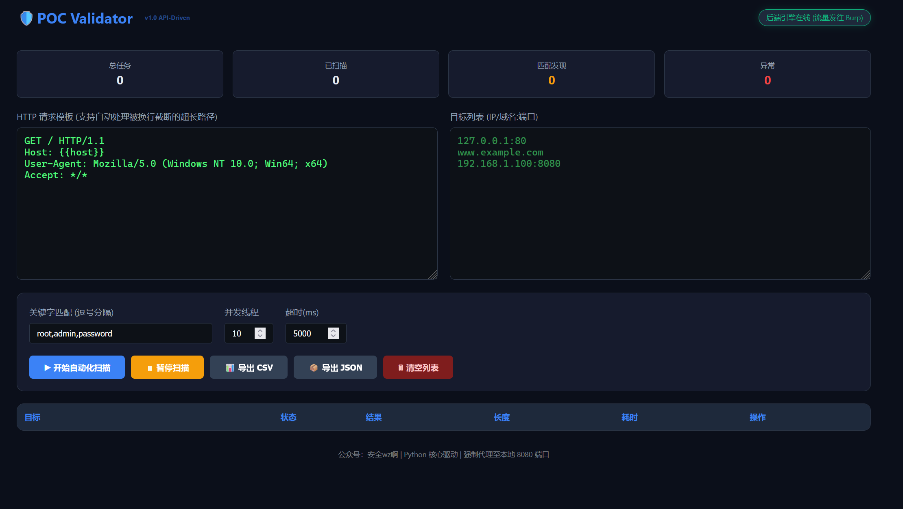
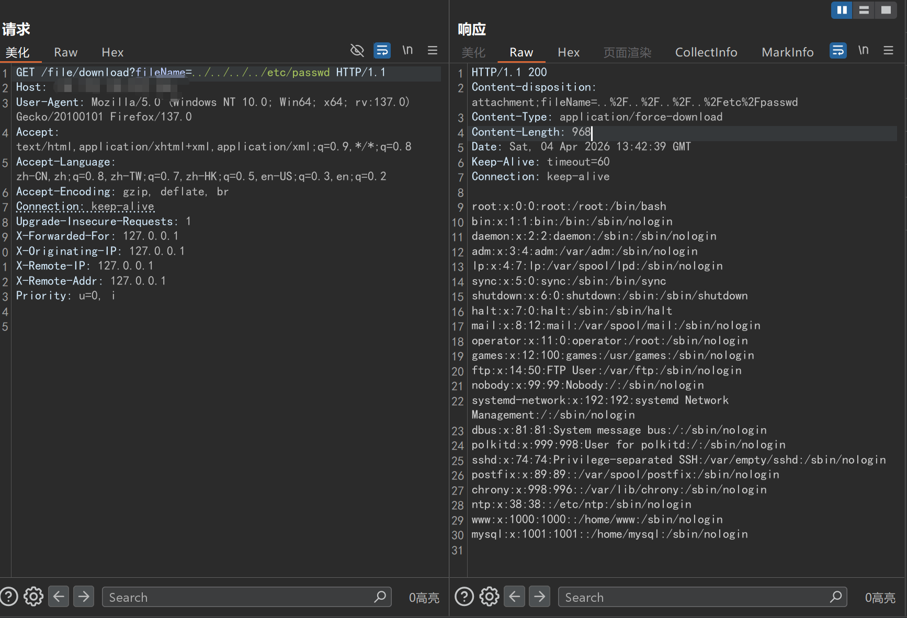
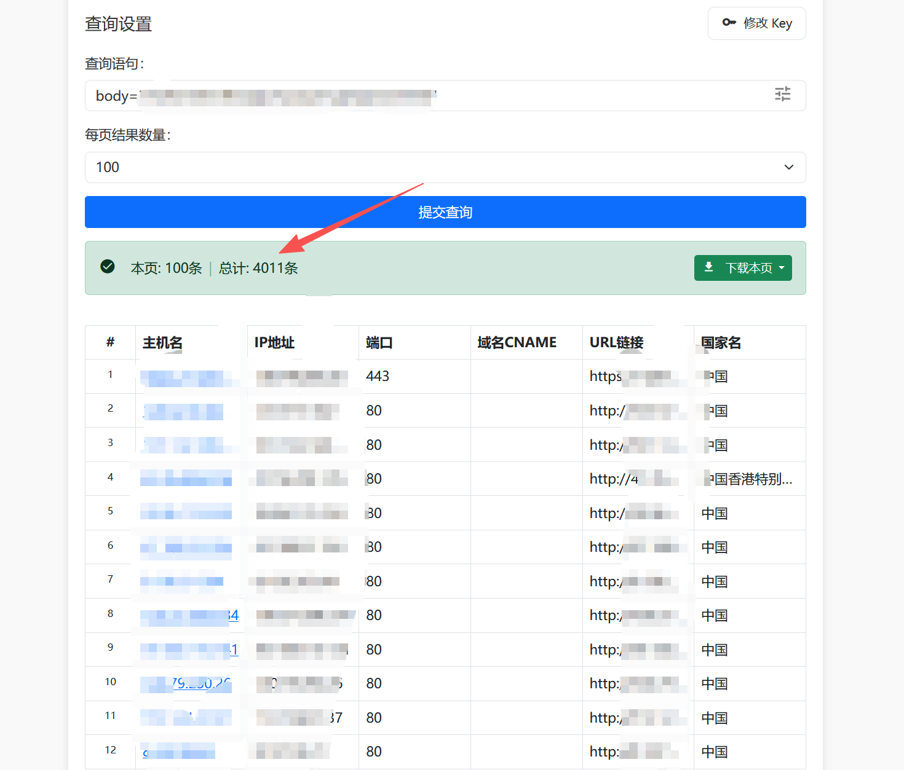
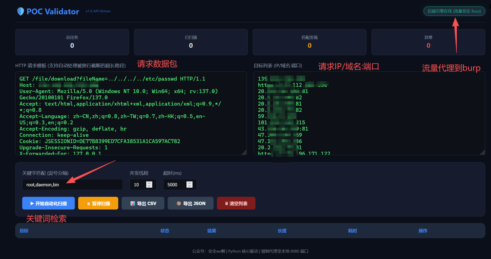
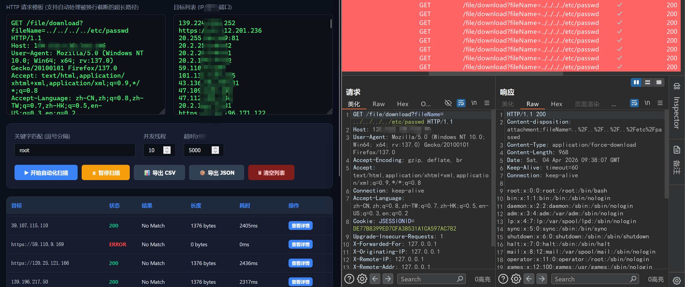
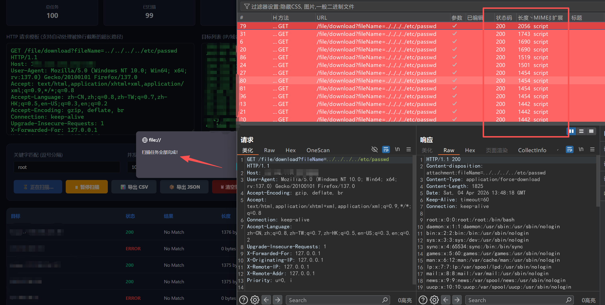
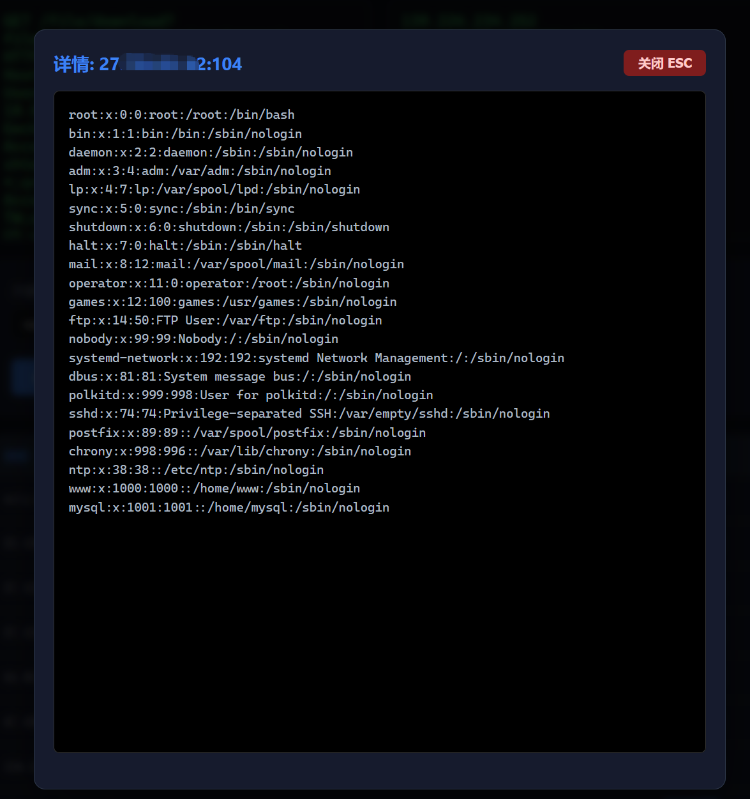

# Universal-POC Validator 使用说明

## 简介

**Universal-POC Validator** 是一款专业的安全测试工具，由公众号「安全wz啊」开发，用于漏洞验证和POC（概念验证）测试。

该工具采用本地服务+网页界面的架构，提供直观、高效的漏洞验证体验，特别适合安全测试人员和渗透测试工程师使用。

## 功能特性

- ✅ **本地服务自动启动**：双击即可运行，无需复杂配置
- ✅ **自动打开网页界面**：友好的用户界面，操作简单直观
- ✅ **Burp Suite 代理集成**：所有流量自动转发到Burp Suite，便于分析和调试
- ✅ **智能POC解析**：支持多种格式的POC数据包解析
- ✅ **单文件运行**：无需安装Python环境，携带方便
- ✅ **跨平台兼容**：在Windows系统上运行稳定

## 技术架构

- **网络**：本地HTTP服务（127.0.0.1:6880）
- **代理**：Burp Suite 集成（127.0.0.1:8080）

## 使用方法

### 1. 启动程序
双击 `Universal-POC validator.exe` 文件即可启动程序。

### 2. 程序运行流程
1. **启动阶段**：程序自动启动本地服务器
2. **界面打开**：自动打开浏览器显示操作界面
3. **配置检查**：自动检测Burp Suite代理连接
4. **测试执行**：用户输入目标和POC后执行测试
5. **结果展示**：实时显示测试结果和响应内容

### 3. 配置 Burp Suite
1. 启动 Burp Suite
2. 在Proxy选项卡中，确保监听地址为 `127.0.0.1:8080`
3. 确保Intercept功能已开启（如需查看请求详情）
4. 无需其他特殊配置，工具会自动使用该代理

### 4. 基本操作步骤
1. **输入目标地址**：在"目标IP"输入框中填写目标服务器地址
2. **粘贴POC数据包**：在"POC数据包"文本框中粘贴完整的HTTP请求数据包
3. **点击测试**：点击"测试"按钮执行验证
4. **查看结果**：在"测试结果"区域查看响应内容和状态
5. **分析流量**：在Burp Suite中查看完整的请求和响应详情

## 运行截图

### 主界面

### 操作界面
**漏洞数据包示例**：
经过测试某网站存在任意文件读取漏洞

**指纹识别结果**：
通过查找指纹得到

**测试配置**：
将请求数据包和目标IP进行添加

### 测试结果

## 常见问题与解决方案

### 1. 程序启动失败
- **原因**：端口 6880 被占用
- **解决方案**：关闭占用该端口的程序，或重启电脑后再试

### 2. 无法连接Burp Suite
- **原因**：Burp Suite 未启动或端口配置错误
- **解决方案**：确保Burp Suite已启动并监听 127.0.0.1:8080

### 3. 测试无响应
- **原因**：目标服务器无法访问或网络问题
- **解决方案**：检查网络连接，确保目标服务器可达

### 4. 临时文件问题
- **现象**：运行时会在临时目录生成文件
- **说明**：这是PyInstaller的正常工作机制，程序退出后会自动清理

## 注意事项
1. **安全使用**：仅用于授权的安全测试，禁止用于非法用途
2. **网络环境**：确保网络连接正常，目标服务器可达
3. **Burp Suite**：必须启动并正确配置Burp Suite
4. **端口占用**：确保 6880 端口未被其他程序占用
5. **程序退出**：关闭命令行窗口即可完全退出程序

## 技术支持
如有问题，请检查：
- 端口 6880 是否被占用
- Burp Suite 是否正常运行
- 防火墙设置是否允许本地连接
- 目标服务器是否可达

## 更新日志
- **v1.0.0**：初始版本
  - 实现基本的POC验证功能
  - 集成Burp Suite代理
  - 提供网页操作界面

## 免责声明
本工具仅用于合法授权的安全测试与漏洞验证，使用本工具必须遵守相关法律法规。严禁用于任何非法活动，一切法律责任由使用者自行承担，与作者及公众号无关。

---

**欢迎关注公众号「安全wz啊」**

